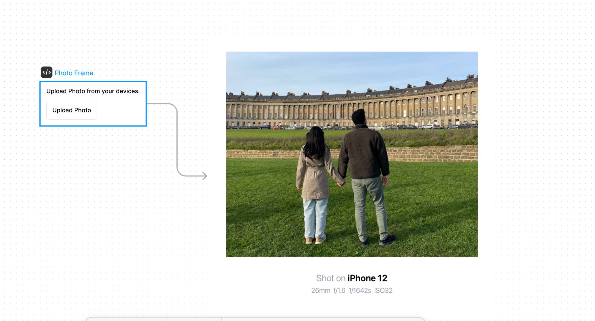

# Figma Photo Frame Widget

Automatically add photo frame with metadata.

Thanks to [What the Frame open source project](https://github.com/mgilangjanuar/what-the-frame/tree/main) by [mgilangjanuar](https://github.com/mgilangjanuar)

